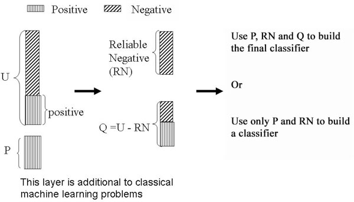

# PULLUP-Fake-Review-Detection

Fake and deceptive reviews pose a significant challenge for online microblogging platforms like Yelp and TripAdvisor. Despite substantial progress in fake review detection over the years, existing solutions often face limitations, such as effectiveness on specific datasets or the need for extensive text feature mining.None of these solutions are particularly fit for large scale deployment which is something required by sites like Yelp. 

In response to these challenges, we present a novel solution leveraging Positive Unlabeled Learning with Bayesian optimization and the SPIES method. This approach aims to enhance the scalability and generalizability of fake review detection. Additionally, we implement Focal Loss to address potential imbalances in the ratio of genuine to fake reviews. 

We use a part of the open yelp dataset which we have manually labelled as the dataset to train our models, further we test it with the 'restaurant-reviews-dataset'(restaurant reviews) and the 'deceptive opinion dataset'(Hotel reviews) to test both unseeen performance on in-domain reviews and cross-domain reviews.

This project is a part of the course ISE 540 at the University of Southern California. Please email sanathsr@usc.edu before utilizing any part of the code and for access to any of the datasets used.  Thank You for visitng our repository

## Table of Contents
- [PU Learning and Spies Algorithm](#bayesian-pu-learning-and-spies-algoirthm)
- [PULLUP-BERT Model](#pullup-model)
- [Classifier Model](#classifier-model)
- [Installation](#installation)
- [Usage](#usage)
- [Training and Evaluation](#training-and-evaluation)
- [Acknowledgments](#acknowledgments)
- [License](#license)
- [Author](#author)

## Bayesian PU Learning and Spies Algorithm


We introduce an uncertainty-powered PU learning approach using the SPIES method. Our workflow involves training an initial model on a Positive Set (P) and a Mix and Spies set (MS). One of the major disadvantages of the SPIES method is that it requires a large number of labeled spies for the algorithm to be effective. We work around this by using Monte Carlo dropout, which induces multiple forward passes of each sample, increasing the variance and uncertainty in predictions.

We utilize the SPIES method to separate likely negative (N) from likely positive (Q) instances and train a second classifier using N as the negative class and Positive (P + Q) as the positive class. Applied to fake review detection in text data, the methodology has proven effective in identifying deceptive content. Explore the code for customization and adaptation to your use case.

## PULLUP-BERT Model

Our model PULLUP-BERT (PU learning using uncertainty progression BERT) implements a bayesain PU learning BERT model that utilizes the spies method. It take in the positive set (P) and the unlabelled set (U) and splits the set U into likely negatives (N), likely positives (Q). Below is a small rundown of all the classes inside PULLUP-BERT.

#### `PULLUPModel`

- **Description:**
  - The core architecture of our model, integrating BERT for contextual embeddings, along with numeric features which we process using an additonal final linear layer.
  
- **Components:**
  - BERT: Utilizes pre-trained BERT for contextualized embeddings.
  - Dropout: Implements dropout for regularization.
  - Numeric Layers: Sequential layers processing numeric features.
  - Combined Layer: A linear layer for final prediction based on concatenated BERT and numeric features.

#### `PULLUPLoss`

- **Description:**
  - Our custom loss function for PULLUP-BERT, which is calculated by combining likelihood loss and entropy regularization.

- **Components:**
  - BCEWithLogitsLoss: Binary cross-entropy loss for likelihoods.
  - Entropy Regularization: Incorporates entropy regularization to manage uncertainty.

#### `PULLUPTrainer`

- **Description:**
  - Trainer class responsible for training the PULLUP-BERT model with a specified number of Monte Carlo samples.

- **Components:**
  - Monte Carlo Passes: Conducts multiple forward passes for uncertainty induction.
  - Target Tensor Computation: Calculates target tensors for training.
  - Training Loop: Iterates through epochs, computes loss, and performs backpropagation.

#### `PULLUPEvaluator`

- **Description:**
  - Evaluator class for assessing model performance with a specified number of Monte Carlo samples during evaluation.

- **Components:**
  - Monte Carlo Passes (Evaluation): Conducts multiple forward passes during evaluation.
  - Mean Values Computation: Computes mean values of likelihoods and entropies.
  - Evaluation: Provides mean likelihoods and entropies for model assessment.

Feel free to explore each of the classes and adapt the PULLUP-BERT model for your specific use case.


## Classifier Final Model

The Classifier model our second stage model that takes in the set of likely negatives (N) and the set of positives and likely positives(P+Q) to train a text classifier. Below is a small rundown of all the classes inside PULLUP-BERT.
#### `ClassifierModel`

- **Description:**
  - Init the pretrained BERT model.
  
- **Components:**
  - BERT Model: Utilizes the pre-trained BERT model for sequence classification.
  - Forward Method: Defines the forward pass to generate logits for classification.

#### `ClassifierTrainer`

- **Description:**
  - Trainer class responsible for training the BERT-based classifier, we also use focal loss here to tackle imbalance that occurs in our use case of fake review detection. 

- **Components:**
  - Model Training: Iterates through epochs, computes the focal loss, and performs backpropagation.
  - Training Loss: Displays and logs the training loss for each epoch.
  
## Installation

To install the required dependencies, run the following command:

```bash
pip install -r requirements.txt
